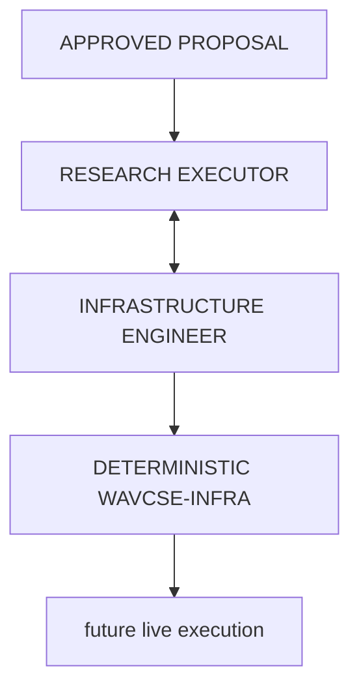

# Execution Plane V1 — INC-021

This is the normative entry point for the boundary from a human-approved research
proposal to a preflighted executable workload. It stops before unauthorized live
execution and does not include result analysis.



The agents reason; deterministic modules enforce. The Infrastructure Engineer is
not infrastructure.

## Existing objects remain authoritative

| Concern | Existing authority | Execution Plane treatment |
|---|---|---|
| Scientific design and human acceptance | `proposals/*.md`, schema/status checked by `proposal_check.py` | Exact path, immutable Git commit and SHA-256 reference; never copied or reinterpreted |
| Registered Study | `STUDIES.jsonl` and `studies/<ID>/PLAN.md` | Referenced when it exists; never created by either specialist |
| Executable study expansion | `studies/<ID>/compute/{plan.json,inputs.json}` and `improvements.compute.jobspec` | Referenced, not duplicated |
| Spend authority | committed `authorizations/<ID>.yaml` | Referenced, never created/renewed/widened |
| Paid orchestration | `python -m improvements.compute` | Sole agent-facing paid-operation seam |
| Provider/worker/storage/job mechanics | deterministic `infra` CLI | Invoked only by the compute backend |
| Runtime ownership and evidence | leases, run ledger, exact job specs, artifact/evidence verification | Remain controller-local authoritative runtime state |

Proposal approval, Study registration, compute authorization and execution are
four distinct events. A preflight artifact grants none of them.

## Roles and authority

### Research Executor

Owns faithful implementation of the approved experiment: code/config delta,
measurements, instrumentation, deterministic outputs, zero-cost validation,
inputs, checkpoint/resume semantics and workload construction.

May modify experiment implementation and tests only when lifecycle gates permit.
May write this proposal's preflight artifacts. Cannot change the proposal or
scientific records, register a Study, create authority, operate infrastructure,
spend, analyse results or declare findings.

Tool grant: `read`, `grep`, `glob`, `find`, `bash`, `edit`, `write`. Generic shell
is necessary for local implementation and checks, but the role forbids paid
verbs and provider calls. The sealed contract, proposal digest and deterministic
backend remain the machine-enforced execution gates.

### Infrastructure Engineer

Owns feasibility, execution strategy, provider/resource reasoning, runtime/cost,
bottleneck diagnosis, deterministic telemetry interpretation, retry/reconcile,
artifact durability and release. It requests implementation changes; it does not
edit science.

Tool grant: `read`, `grep`, `glob`, `find`, `bash`, `edit`, `write`. In OPERATE
mode it writes only assessments/negotiation state and invokes deterministic
interfaces. Source edits are legal only after entering MAINTAIN mode with a
persisted paused failure.

Neither agent receives literature mutation tools, proposal/study/authorization
mutation authority, task delegation, web search, or a provider-specific tool.

## Typed handoff objects

`execution_contract.py` defines strict, unknown-key-rejecting, canonical-JSON
schemas. Every document carries a SHA-256 over its content excluding only its own
digest field.

### `execution_workload`

The Executor's handoff contains:

- workload id and monotonic revision;
- exact approved-proposal id/path/commit/SHA-256/approval identity;
- explicit `scientific_invariants` derived from that proposal;
- finite `implementation_flexible` choices and equivalence guards;
- implementation status, exact commit, argv entrypoint, environment, local
  validation evidence and checkpoint/resume semantics;
- required inputs and outputs with integrity requirements;
- non-binding resource constraints and runtime/cost estimates, preserving
  unknown values as `null`;
- references to the existing Study plan, compute plan and authorization;
- readiness and blockers.

The workload does not contain a second job spec, worker request, budget envelope,
lease or artifact manifest. Those existing types remain authoritative.

A revision must bind the prior workload and assessment. The validator requires
proposal identity and the complete scientific-invariant list to remain equal and
allows only values explicitly requested for predeclared flexible choices.

### `execution_assessment`

The Infrastructure Engineer's handoff contains:

- exact workload id/revision/digest and negotiation round;
- mode and exact infra repository commit/tree state/version;
- one decision;
- feasibility, strategy, resource recommendation, runtime/cost estimates;
- expected versus observed bottlenecks;
- deterministic telemetry sources and event/threshold reasoning triggers;
- typed change requests;
- failure class, policy state, blockers and recommended action;
- maintain-mode pause/fix/re-evaluation provenance.

`ACCEPT` validates only for a `VALIDATED` workload with a registered Study,
compute plan and committed bounded authorization. Acceptance is still not the
act of execution.

### `execution_negotiation`

The negotiation contains only references to sealed workloads and assessments,
a fixed maximum of three assessment rounds, current state, and escalation.
`transcript_required` must be `false`. A fresh agent can reconstruct the whole
exchange from files; neither specialist transcript is evidence or state.

## Scientific invariant mechanism

The Executor derives the actual invariant set from the approved proposal. No
global list decides what is scientific. Each invariant has a stable id, source
locator, name and JSON value. Implementation-flexible choices are separate,
finite and guarded.

Infra requests carry one classification and target id:

- `IMPLEMENTATION_FLEXIBLE`: target must exist in the workload's flexible set and
  the requested value must be allowed;
- `SCIENTIFIC_INVARIANT`: target must exist in the invariant set and the decision
  is `SCIENTIFIC_CHANGE_REQUIRED`.

The revision validator compares invariant structures exactly. Any mutation fails
closed and requires Main OMP escalation.

## Negotiation state machine

```text
PENDING_INFRA
  ├─ ACCEPT                         -> PREFLIGHT_ACCEPTED
  ├─ BLOCKED                        -> BLOCKED
  ├─ SCIENTIFIC_CHANGE_REQUIRED     -> ESCALATED_SCIENTIFIC_CHANGE
  └─ REQUEST_IMPLEMENTATION_CHANGE  -> CHANGES_REQUESTED
                                          |
                                          | validated workload revision
                                          v
                                     PENDING_INFRA
```

A flexible request at the third assessment round becomes
`ESCALATED_CONVERGENCE_LIMIT`; no fourth round starts. Persistent disagreement,
a blocker, authority/policy/budget choice or scientific change goes to Main OMP.
Main OMP is not a router for ordinary flexible revisions.

## Operate and maintain modes

**OPERATE:** read/validate workload; inspect read-only deterministic state;
assess; then, only after all independent human/lifecycle gates, invoke permitted
`improvements.compute` operations. The agent never calls a provider directly.

**MAINTAIN:** first persist `BLOCKED`/paused state and failure evidence; reproduce
the infra defect; fix the owning infra seam with a regression test; commit the
fix; record the exact fix commit; then explicitly re-evaluate worker/job state.
A patch is never silently applied to a live run, and a dirty tree is not an
operable infra version.

## Monitoring boundary

Deterministic observation may expose worker/job state, process liveness,
heartbeat/progress, logs, GPU model and memory capacity, disk availability,
artifact progress, runtime and derived cost. The Infrastructure Engineer reasons
about bottlenecks and intervention from those facts.

GPU utilization, CPU/RAM utilization, disk I/O and network throughput are not
currently exposed by the embedded control plane. They remain unknown. Add only a
bounded deterministic snapshot/event when an actual decision needs one; do not
build LLM polling or a monitoring platform.

## Cleanup and cost boundary

The agent may decide to release early. Safety does not depend on that decision:
committed envelopes cap hourly/total/wall-clock spend; create intents and leases
bind ownership; attempt budgets survive restart; finish/sweep are guarded; and
the independent reaper stops attributable workers after lease deadlines. Unknown
price/lifetime/spend fails closed. Destruction never targets an unowned resource
or canonical storage and requires verified outputs where policy requires them.

## Current vertical slice

`preflights/DP-0008/` binds the real approved DG-0008 proposal. It records a
realistic flexible negotiation about bounded-memory opportunity-manifest
construction while preserving byte-identical canonical JSON and digest rules.
The final assessment is `BLOCKED`, correctly, because DG-0008 is unregistered,
has no authorization, lacks lawful raw-corpus restoration/identity evidence,
has no implemented/validated compute plan, has unknown benchmark/runtime/cost,
and the control plane it resolved to was not the canonical `wavcse-infra`. That
last claim is now corrected: the canonical `wavcse-infra` `main`
(`540b617f66d4fc8c11419fb606a64047f085d529`, version `0.1.0`) implements the
`job`, `storage` and network-volume surfaces `improvements.compute` calls **and**
a Colab provider — the approved primary — alongside RunPod as secondary, over a
new `COLAB_EXEC` execution transport. Both wavCSE-side items recorded at the time
are now closed and recorded in `CONTROLLER_HANDOFF.md`: the control plane is
bound explicitly, and a provider-mutating verb refuses a merely discovered one
(the embedded `wavCSE/infra` fork otherwise wins resolution) instead of relying
on the convention; and the compute seam is provider-neutral, so the Colab path
is drivable through `improvements.compute`. The execution-scope-kind contract
(`study` | `infrastructure_validation`) is what the `IN-0001` smoke scope uses;
see `../../../compute/README.md` §"Execution scope".

Validate it with:

```text
uv run --locked python -m improvements.taskrelation.research.execution_contract \
  check improvements/taskrelation/research/execution/preflights/DP-0008
```

No live resource was created and no scientific endpoint was read.

## Handoff and preflight lifecycle

The deterministic development→controller handoff is
[`CONTROLLER_HANDOFF.md`](CONTROLLER_HANDOFF.md): identities, the `wavcse-infra`
commit to bind, the controller-only checks and the unresolved Colab question.

A preflight instance is terminal once its negotiation reaches a terminal state;
`DP-0008-N01` is `BLOCKED` and must never be rewritten. A fresh attempt is a new
**instance** — a new preflight directory with a new negotiation id created
through `execution_contract.new_negotiation` — never an edit of the sealed one,
because `check_directory` requires exactly one negotiation per directory. History
is preserved, not reopened.
